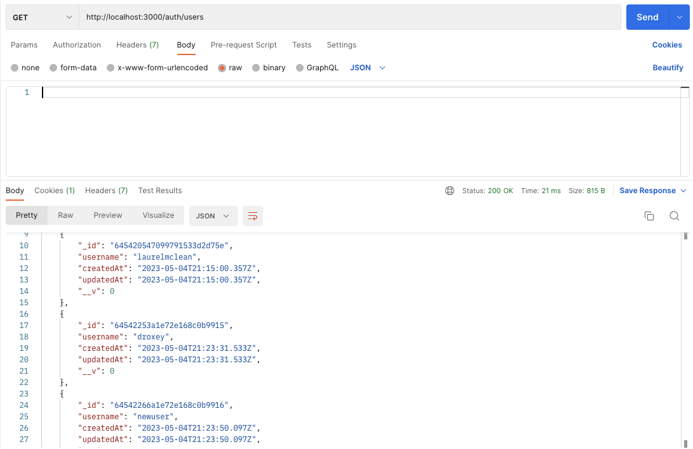
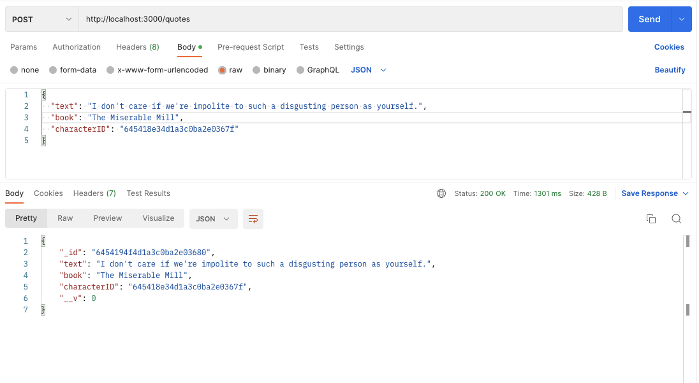
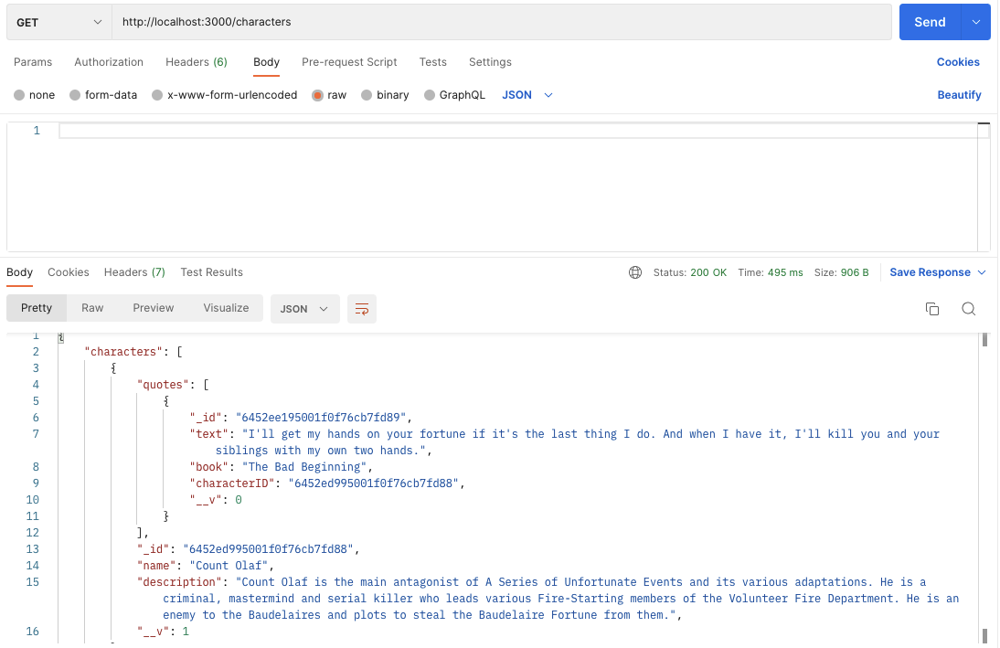
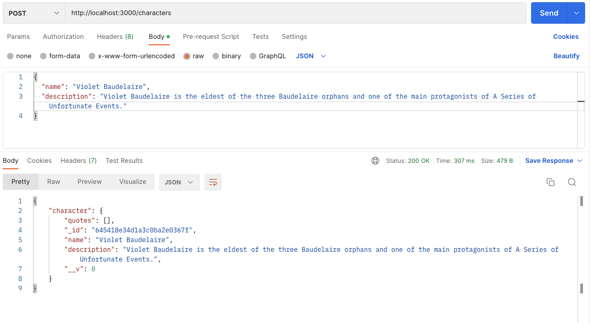

# A Series of Unfortunate API Calls

"A Series of Unfortunate API Calls" is a RESTful API that allows developers to access a rich collection of characters and memorable quotes from the beloved book series, "A Series of Unfortunate Events" by Lemony Snicket. This API provides a treasure trove of information for fans and enthusiasts who want to incorporate the essence of the series into their applications, websites, or creative projects.

With the "Series of Unfortunate API Calls", developers can retrieve detailed profiles of the intriguing characters that populate the series, including the resilient Baudelaire siblings, the cunning Count Olaf, and the enigmatic Lemony Snicket himself. Each character profile includes relevant details about the character.

Additionally, the API offers a vast collection of quotes from the books, capturing the clever wordplay, dark humor, and philosophical musings that make the series so distinctive. Developers can access quotes by specific characters, providing ample material to add a touch of the series' charm to their applications or creative endeavors.

The "Series of Unfortunate API Calls" provides a seamless and intuitive interface, offering various endpoints to retrieve character profiles, search for specific quotes, or discover quotes based on character. The API documentation provides clear guidelines on how to make API calls, including necessary parameters and response formats, enabling developers to easily integrate the characters and quotes into their projects.

Whether you're building a fan site, developing a game, or simply seeking to engage with the Series of Unfortunate Events universe, the "Series of Unfortunate API Calls" serves as the ideal resource to bring the characters and quotes to life in your application, allowing users to immerse themselves in the captivating world of unfortunate events.


## Table of Contents

- [Features](#features)
- [API Documentation](#api-documentation)
- [Getting Started](#getting-started)
- [Installation](#installation)
- [Usage](#usage)


## Features

- Retrieve quotes from the Series of Unfortunate Events books
- Authenticated users can perform CRUD operations (Create, Read, Update, and Destroy) on characters and their quotes
- Comprehensive API documentation
- Developed using a Test Driven Development Approach (tests in place for quote, character, and user routes)

## API Documentation

View on Docsify: https://laurelmclean.github.io/series-of-unfortunate-api-calls/

### Getting Started

These instructions will help you set up and run the Series of Unfortunate API Calls on your local machine for development and testing purposes.

### Prerequisites

- Node.js (v14.x or higher)
- npm (v6.x or higher)
- MongoDB
- Git

### Installation

1. Clone the repository:
   ```bash
   git clone https://github.com/laurelmclean/series-of-unfortunate-api-calls.git
   ```

2. Install dependencies:
    ``` npm install ```

3. Create a `.env` file in the project root and add your MongoDB connection string: 

    ```MONGODB_URI=YOUR_MONGODB_CONNECTION_STRING```

4. Seed the database:
    ```node seed.js```

5. Run the development server:
    ```npm start```

### Usage

The API provides the following endpoints for retrieving characters and quotes:

### Authentication

#### Sign Up
- Endpoint: /auth/sign-up
- Method: POST
- Description: Creates a new user account.

Request Parameters
```json
{
  "username": "The username for the new account. Must be unique.",
  "password": "The password for the new account."
}

```

#### Login
- Endpoint: /auth/login
- Method: POST
- Description: Authenticates a user and generates an authentication token.

Request Parameters

```json
{
  "username": "The username to authenticate.",
  "password": "The password to authenticate."
}

```

#### Logout
- Endpoint: /auth/logout
- Method: GET
- Description: Logs out the currently authenticated user and invalidates the authentication token.

#### Users
- Endpoint: /auth/users
- Method: GET
- Description: Displays all registered users.



### Quotes

- `GET /quotes`: Get all quotes.
- `GET /quotes/{quoteId}`: Get a specific quote by ID.
- `POST /quotes`: Add a new quote.
- `PUT /quotes/{quoteId}`: Update an existing quote.
- `DELETE /quotes/{quoteId}`: Delete a quote.

#### Add a new quote

To add a new quote, make a `POST` request to `/quotes` with the following request body:

```json
{
  "text": "The quote text goes here",
  "book": "The book title goes here",
  "characterID": "The ID of the associated character"
}

```

Ensure that you provide the required fields in the request body: text, book, and characterID. Upon successful creation, the API will return the newly created quote.



#### Update a quote

To update an existing quote, make a PUT request to /quotes/{quoteId} with the following request body:

```json
{
  "text": "The updated quote text goes here",
  "book": "The updated book title goes here"
}
```

Provide the updated values for the fields you want to change: text and book. The API will return the updated quote upon successful update.

### Characters

- `GET /characters`: Get all characters.
- `GET /characters/{characterId}`: Get a specific character by ID.
- `POST /characters`: Add a new character.
- `PUT /characters/{characterId}`: Update an existing character.
- `DELETE /characters/{characterId}`: Delete a character.



#### Add a new character

To add a new character, make a POST request to /characters with the following request body:

```json
{
  "name": "The character name goes here",
  "description": "The character description goes here"
}
```

Ensure that you provide the required fields in the request body: name and description. The API will return the newly created character.



#### Update an existing character

To update an existing character, make a PUT request to /characters/{characterId} with the following request body:

```json
{
  "name": "The updated character name goes here",
  "description": "The updated character description goes here"
}
```
